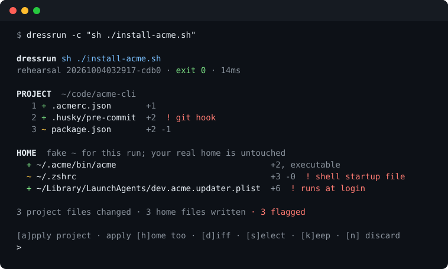
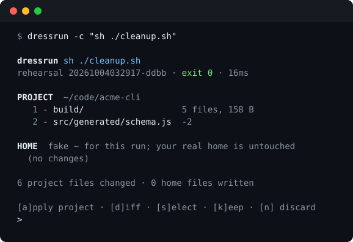

<h1 align="center">dressrun</h1>

<p align="center"><b>Run any command on a throwaway copy of your project and a fake <code>$HOME</code>. See exactly what it changed. Then apply it or throw it away.</b></p>

<p align="center">
  <a href="https://github.com/Nithinfgs/dressrun/actions/workflows/ci.yml"></a>
  
  
  
  
</p>

<p align="center">
  
</p>

The screenshot is real output from [`examples/`](examples/): an installer that looks harmless, rehearsed. It adds a git hook, edits `~/.zshrc`, and registers a LaunchAgent that runs at login. None of it touched the real machine.

## 20-second version

```bash
cd my-project
npx github:Nithinfgs/dressrun -- <any command>     # e.g.  -- sh ./install.sh   or   -c "curl -fsSL https://… | sh"
```

1. dressrun clones your directory (copy-on-write where the filesystem supports it) and points `HOME` at an empty-ish fake one.
2. Your command runs there, unmodified, with your terminal attached.
3. You get a report of every file added, modified, deleted or chmod-ed, in the project **and** in `~`, with warnings for files that run code later.
4. You choose: **apply** the project changes (and optionally the home ones), look at a **diff**, **select** parts, **keep** it for later, or **discard**.

## Why this exists

`--dry-run` only exists when the tool's author wrote it, and it can drift from what the real run does. Docker is heavy and gives you no "apply this part, skip that part". `git status` after the fact is too late, and it cannot see `~/.zshrc`, a LaunchAgent, or an ignored file.

Lots of everyday commands are exactly the ones you would like to look at first: `curl … | sh` installers, codemods and `prettier --write .`, cleanup scripts with a glob that is a bit too greedy, `git rebase` and release scripts, and whatever command a coding agent just proposed. dressrun makes "run it, see the damage, decide" the default for all of them without needing support from the tool.

## Quick start

Requirements: Node 18.17+, macOS or Linux, `git` optional.

```bash
# straight from GitHub, nothing to install
npx github:Nithinfgs/dressrun -- npm install left-pad

# or install the command
npm install -g github:Nithinfgs/dressrun
dressrun -- npx prettier --write .
```

Try the bundled examples without any risk (nothing is applied unless you say so):

```bash
git clone https://github.com/Nithinfgs/dressrun && cd dressrun
cp -R examples/demo-project /tmp/acme-cli && cd /tmp/acme-cli
git init -q && git add -A && git commit -qm init
node ~/path/to/dressrun/bin/dressrun.js -c "sh ./install-acme.sh"   # an installer
node ~/path/to/dressrun/bin/dressrun.js -c "sh ./cleanup.sh"        # a cleanup with a bug
```

## Example: the cleanup script that deletes too much

<p align="center">
  
</p>

The script was meant to clear `build/`. The report shows it also deletes `src/generated/schema.js`, which cannot be regenerated offline. Press `n` and nothing happened. Press `s`, then `1`, and only the `build/` removal is applied.

## Features

- **Works on any command.** No tool-specific `--dry-run` needed; the command runs for real, in a clone.
- **Two sandboxes in one report.** The project directory *and* a fake `$HOME` (plus `XDG_*` and `TMPDIR`), so dotfile, LaunchAgent and PATH edits are caught.
- **Honest diffs.** Files that were only touched, or rewritten with identical bytes, are not reported. Large new or removed directories and `.git/` collapse into one line.
- **Warnings where it matters.** Shell startup files, `~/.ssh`, LaunchAgents/systemd user units, git hooks, CI workflows, `.env` files and coding-agent config (`.claude/`, `.cursor/`, `.mcp.json`) are flagged.
- **Safe apply.** Selected entries are copied back; a file that changed in your real tree after the rehearsal started is skipped (override with `--force`). Home changes are never applied unless you ask (`h` at the prompt, or `apply --home`), and the fake home path inside text files is rewritten to your real home.
- **Scriptable.** `--json`, `--apply`, `--discard`, and `ls | show | apply | discard` subcommands, so CI jobs and coding agents can rehearse, inspect the report, and apply later.
- **Zero runtime dependencies.** One small Node.js program.

### Everyday commands

```text
dressrun [options] -- <command> [args...]    rehearse a command
dressrun [options] -c "<shell string>"       rehearse a shell snippet (pipes, &&, redirects)
dressrun ls                                  list kept rehearsals
dressrun show [id] [--diff] [--json]         re-display a report
dressrun apply [id] [--home] [--only <glob>] [--force]
dressrun discard [id | --all]
```

Useful run options: `--exclude node_modules`, `--root <dir>`, `--max-size <MB>`, `--home real`, `--seed <file>`, `--diff`, `--json`. Run `dressrun help` for the full list.

### For scripts and coding agents

```bash
dressrun --json --discard -c "$PROPOSED_COMMAND" > report.json   # inspect without changing anything
dressrun --keep -c "$PROPOSED_COMMAND"                            # rehearse, keep the session
dressrun show --json                                              # machine-readable report
dressrun apply --only 'src/**'                                    # apply just part of it
```

With `--json`, the command's own stdout goes to stderr so the report on stdout stays parseable. dressrun exits with the command's exit code (`64` for usage errors, `70` for internal errors, `3` if `apply` skipped conflicts).

## How it works

```
real project ──walk──▶ baseline            fake HOME (seeded with shell rc + .gitconfig)
      │                                          │
      └──copy-on-write clone──▶ session/work     │
                                    │            │
                    run: cwd=work, HOME=fake ◀───┘
                                    │
                  walk + compare (stat first, content to confirm)
                                    │
                         grouped, flagged report
                                    │
            apply (conflict-checked)  /  discard (rm -r session)
```

Details, design decisions and known limits are in [docs/architecture.md](docs/architecture.md).

## What dressrun is not

**It is not a security sandbox.** The command runs with your permissions and your network. Anything that writes to an absolute path outside the project and the fake home, talks to Docker or a database, or calls a remote API still does so for real. Use dressrun to *see and control file changes*, not to make untrusted code safe. See [SECURITY.md](SECURITY.md).

Other limits worth knowing:

- On filesystems without reflinks (ext4, many CI runners) the clone is a full copy. There is a size guard (`--max-size`) and `--exclude`.
- Tools that cache in your real home (npm, pip, cargo) start with a cold cache in the fake one.
- macOS and Linux only for now.

## Use cases

- Check an installer before you let it near your dotfiles.
- Preview a codemod, formatter or lockfile change across the whole repo.
- Dry-run a cleanup or migration script that has no `--dry-run`.
- Rehearse a history rewrite (`git rebase`, `filter-repo`): `.git` is cloned too.
- Put a review step in front of a command a coding agent wants to run.

## Roadmap

- [ ] Per-hunk apply
- [ ] Windows support
- [ ] Optional network blocking where the OS allows it (`sandbox-exec`, `unshare -n`)
- [ ] `--exclude-from .gitignore`
- [ ] Publish to npm (`npx dressrun`)
- [ ] Hook mode for coding agents that support pre-command hooks

## Contributing

Issues and pull requests are welcome; start with [CONTRIBUTING.md](CONTRIBUTING.md). The suite is `npm run check` (eslint, TypeScript `checkJs`, and `node:test` end-to-end tests that never touch your real home).

## License

[MIT](LICENSE)
