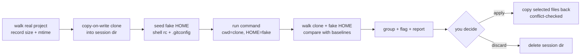

# Architecture

dressrun is about 1,200 lines of dependency-free Node.js. The whole idea is one pipeline:

## Modules

| File | Responsibility |
| --- | --- |
| `src/session.js` | Creates the session directory, clones, seeds the fake home, runs the command, builds reports, and persists everything under `$DRESSRUN_DIR` (default: `$TMPDIR/dressrun-<uid>`) so `show` / `apply` work later. |
| `src/clone.js` | `fs.cpSync` with `COPYFILE_FICLONE`: APFS `clonefile`, btrfs/XFS reflinks, plain copy otherwise. Sockets, FIFOs and devices are skipped. |
| `src/walk.js` | Tree snapshot: relative path to `{type, size, mtimeMs, mode, link}`. |
| `src/changes.js` | Baseline vs. current. A file is a candidate when size, mtime or mode differ; candidates are confirmed by comparing content with the pristine copy, so `touch` and rewrites with identical content are not reported. |
| `src/group.js` | Collapses `.git/`, new directories and removed directories into single reviewable entries. |
| `src/sensitive.js` | Path rules that flag files which run code later or hold credentials. |
| `src/apply.js` | Copies selected entries back. Applies conflict rules, rewrites the fake home path in text files, refuses paths that escape the target root. |
| `src/diff.js` | Myers line diff and unified-diff output. |
| `src/render.js`, `src/prompt.js`, `src/cli.js` | Terminal UI and argument handling. |

## Design decisions

**Baselines come from stat, not hashes.** Hashing a whole `node_modules` before every run would dominate
the runtime. Instead the tool records `size + mtime + mode` for the real tree (before cloning) and for the
clone (after cloning). Only files whose stat changed are read and compared.

**Conflict detection uses the real tree's baseline.** At apply time, a modified or deleted file is only
touched if its real `size + mtime` still match what the tree looked like when the rehearsal started. This is
what keeps `apply` from clobbering edits you made while the rehearsal was waiting for your decision.

**The fake home is seeded.** Installers usually *append* to `~/.zshrc`. If the fake home started empty, that
would look like a brand-new file and could never be applied sanely. Shell startup files and `.gitconfig` are
therefore copied in first, so an append is reported as `+1 -0` with a diff, and `apply --home` is checked
against the real file's stat.

**Path rewriting.** Files in the fake home often contain the fake home's absolute path
(`export PATH=/tmp/dressrun-.../home/.acme/bin:$PATH`). When applying home files, text files have that prefix
rewritten to the real home. Binaries are copied untouched; a compiled binary that embedded the fake path will
not be fixed up.

**`.git` is cloned and applied as one entry.** Rehearsing `git rebase`, `git filter-repo` or a release script
works because the clone has its own repository. Applying `.git/` metadata copies refs, objects and the index
as a unit; select it deliberately.

## Known limits

- **Not a sandbox.** Absolute paths outside the project and fake home, network calls, daemons and
  environment-variable secrets are not contained. See [SECURITY.md](../SECURITY.md).
- **Clone cost.** On filesystems without reflinks (ext4, most CI runners) the clone is a real copy. A size
  limit (`--max-size`, default 1 GiB) and `--exclude` keep this honest.
- **Excluded paths are invisible to the command**, so a build that needs `node_modules` will reinstall it
  inside the clone.
- **Tools that cache in the real home** (npm, pip, cargo) start cold in the fake home.
- **macOS and Linux only.** Windows needs a different clone and home-redirection strategy.
- **Time-of-check races.** Files changing in the real tree *during* the clone are not detected.
